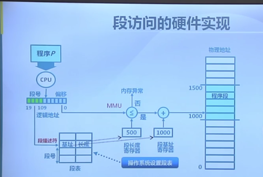
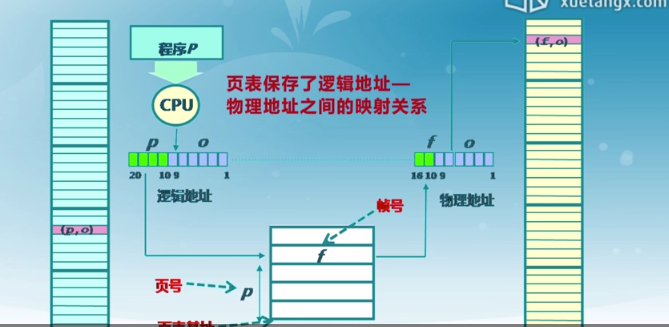
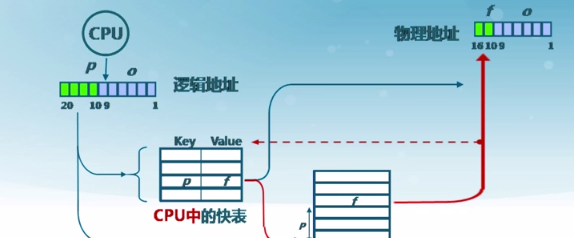
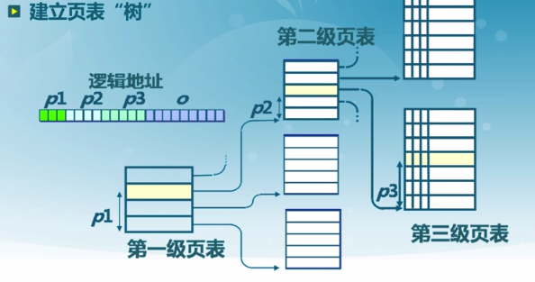
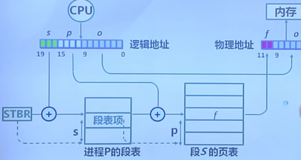
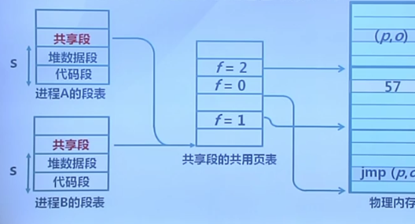

## 动机

- 连续内存分配很有可能找不到该连续的内存区域，是否可以采用非连续内存分配？
- 提高内存利用效率和管理灵活性
  - 允许一个程序的使用非连续的物理地址空间
  - 允许共享代码与数据
  - 支持动态加载和动态链接

## 实现

- 非连续分配要解决的问题
  - 如何实现虚拟地址和物理地址的转化
  - 硬件实现(够用，开销小)
  - 软件实现(够用，开销小)

- 非连续分配的硬件辅助机制
  - 如何选择非连续分配中的内存分块大小
    - 段式存储管理
    - 页式存储管理

## 段式存储管理

 - 在进程模型中物理地址空间各个段分离，段内连续通过偏移访问，各个段之间不连续。

- 段的概念
  - 段表示访问方式和存储数据等属性相同的一段地址空间
  - 对应一个连续的内存块
  - 若干个段组成进程的逻辑地址空间

- 段的访问：逻辑地址由二元组（s.addr）表示
  - s —— 段号
  - addr —— 段内偏移

## 页式内存管理

- 页帧（帧、物理页面，Frame）
  - 把物理地址空间划分为大小相同的基本分配单位
  - 2的n次方

- 页面（逻辑页面，Page）
  - 把逻辑地址空间也划分为相同大小的基本分配单位
  - 帧和页的大小必须是相同的

- 页面到页帧
  - 逻辑地址到物理地址的转化
  - 页表
  - MMU/TLB

- 页式存储中的地址映射
  - 页到帧的映射
  - 逻辑地址中的页号是连续的
  - 物理地址中的帧号是不连续的
  - 不是所有的页都有对应的帧

- 页表

  - 保存了逻辑地址和物理地址之间的映射关系

    

## 页表

- 每个进程都有一个页表
  - 每个页面对应一个页表项
  - 随进程运行状态而动态变化
  - 页表基址寄存器

- 页表项组成
  - 帧号
  - 页表项标志
    - 存在位
    - 修改位
    - 引用位

## 页式存储管理机制的性能问题

- 内存访问性能问题
  - 访问一个内存单元需要2次内存访问
  - 第一次访问：获取页表项
  - 第二次访问：访问数据

- 页表大小问题
  - 页表可能非常大
  - 64位机器如果每页1024，那么一个页表的大小会2^57;

- 如何处理
  - 缓存
  - 间接访问

## 快表(Translation Look-aside Buffer,TLB)

- 缓存近期访问的页表项

  - TLB使用关联存储器实现，具备快速访问性能

  - 如果TLB命中，物理页号可以很快被获取

    

##  多级页表

- 通过间接引用将页号分为k级

  - 建立页表树

    

## 段页式存储管理

- 段式存储在内存保护访问方面有有优势，页式存储在内存利用和优化转移到后配有优势。

- 在段式存储管理基础上，在给每个段加一级页表

  

- 进程段共享

  - 指向相同的页表基址

    

