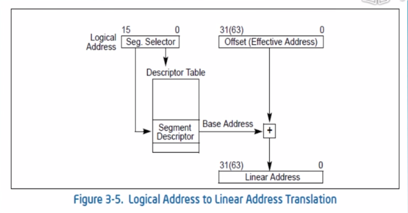
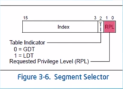

# 动机

- 1

  8086的地址总线为20位 寻址空间为1MB，8086的寄存器为16位，寻址空间为64KB。

  为了完美的利用资源，可以将地址分为16个段，每个段由段基址和段内偏移组成。所以

  物理地址 = 段基地址 * 16 + 段内偏移 。 **在实模式下，段内存放段基址，直接计算即得**

  **物理地址。在保护模式下段内存放的是段选择子，用段选择子到段描述符表中取得段基址**

  **再加上偏移得到线性地址(并非物理地址)**

# 原理

##　段选择符(Segment Selector)

段选择符的前13位存放着GDT(全局描述符表)的index.RPL代表该段的段优先级，再x86系统下RPL占两位，

0代表操作系统的优先级，1代表用户进程的优先级.

## 全局描述符表(Global Descriptor Table)

