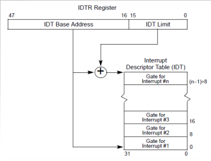
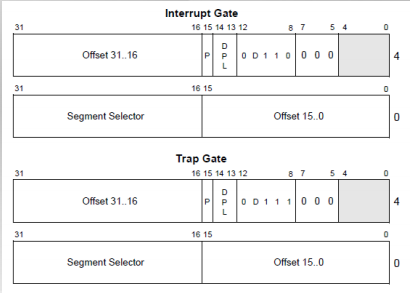
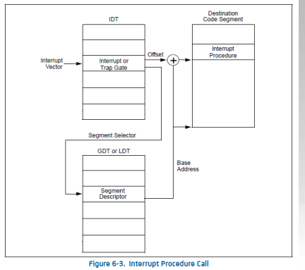

## X86的中断处理 - 中断源

- 中断 Interrupts

  ​	外部中断External(hardware generated) interrupt

  ​	串口、硬盘、网卡

  ​	软件产生的中断Software generated interputs

  ​	The INT n指令 ， 通常用于系统调用

- 异常 Exceptions
  - 程序错误
  - 软件产生的异常
  - 机器检查出的异常

## X86中的中断处理 - 确定中断服务例程

-  每个中断或异常与一个中断服务历程(Interrupt Service Routine,简称ISR)关联,其关联关系存储在中断描述符表(Interrupt Descriptor Table ,简称IDT)。

- IDT的起始地址和大小保存在中断描述符表寄存器IDTR中。

  

  每个中断门(陷阱门)详细信息

  ​										

  中断服务例程调用

  ​							

- 中断服务例程的调用过程

  当产生中断后,操作系统会从IDTR Register 找到中断描述符表的地址(IDT),再根据不同的中断历程找到对应不同的段描述符。段描述符表存放这该服务例程的段选择子(Segment Selector)  段选择子 存放着指向全局描述表中的index。再从GTD里找到全局描述符来启动中断服务例程。

## 切换到中断服务例程

- 不同特权级的中断切换到对堆栈的影响

  断的底两位决定了该段的特权级。如果该段的特权级为3则运行在用户态，为0运行在内核态。不同特权级的段在发生中断服务例程时对堆栈有着不同的影响。

  **在内核态发生中断切换**

  

  **用户态发生中断切换**

  ​					

# 从中断服务例程(ISR)返回

- iret: 中断服务例程返回

- ret (retf)：函数调用返回

  iret弹出EFLAGS和SS/ESP(根据是否改变特权级) ret弹出EIP,retf弹出CS和EIP

# 系统调用

- 用户通过系统调用访问OS内核

- 如何实现系统调用
  - 需要指定中断号
  - 使用软中断int80
  - 使用特殊指令(SYSENTER/SYSEXIT)

## 补充

中断处理中硬件负责完成的工作

中断服务例程包括具体负责处理中断（异常）的代码是操作系统的重要组成部分。需要注意区别的是，有两个过程由硬件来完成：

- 硬件中断处理过程1（起始）：从CPU收到中断事件后，打断当前程序或任务的执行，根据某种机制跳转到中断服务例程去执行的过程。具体流程如下：

  - CPU在执行完当前程序的每一条指令后，都会确认在执行刚才的指令过程中中断控制器（如8259A）是否发送中断请求过来，如果有那么CPU就会在相应的时钟脉冲到来时从总线上读取中断请求对应的中断向量
  - CPU根据得到的中断向量（以此为索引）到IDT中找到该向量对应的中断描述符，中断描述符里保存着中断服务例程的段选择子。
  - CPU使用IDT查到的中断服务例程的段选择子从GDT中取得相应的段描述符，段描述符里保存了中断服务例程的段基址和属性信息，此时CPU就得到了中断服务例程的起始地址，并跳转到该地址。

  - CPU会根据CPL和中断服务例程的段描述符的DPL信息确认是否发生了特权级转换，这时CPU会从当前程序的TSS信息（该信息在内存中的起始地址存在TR寄存器中）里取得该程序的内核栈地址，即包括内核态的SS和esp的值，并立即将系统当前使用的栈切换成新的内核栈。这个栈是即将运行的中断服务程序要使用的栈。紧接着就将当前程序使用的用户态的ss和esp压倒新的内核栈中保存起来
  - CPU需要开始保存当前被打断的程序的现场（即一些寄存器的值），以便于将来恢复被打断的程序继续执行。这需要利用内核栈来保存相关现场信息。

- 硬件中断处理过程2（结束）：每个中断服务例程在有中断处理工作完成后需要通过iret指令恢复被打断的程序的执行。CPU执行IRET指令的具体过程如下：
  - 程序执行这条iret指令时，首先会从内核栈里弹出先前保存的被打断的程序的现场信息，即EFLAGS，CS,EIP重新开始执行；
  - 如果存在特权级转换（从内核态转换到用户态），则还需要从内核栈中弹出用户态栈的SS和ESP
  - 如果此次处理的是带有错误码（errorCode）的异常，CPU在恢复先前程序的现场时，并不会弹出errorCode。这一步需要通过软件完成，即要求相关的中断服务例程在调用iret返回之前添加栈代码主动弹出errorCode。