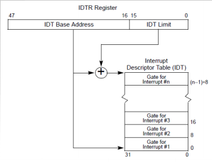
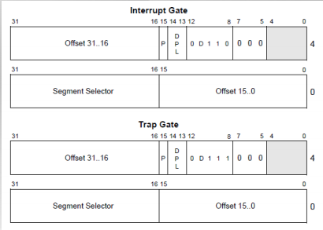
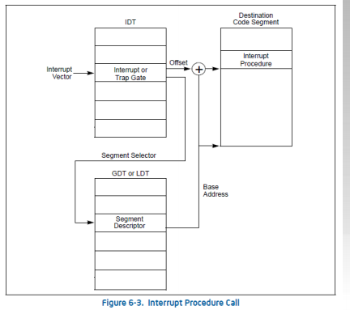

## X86的中断处理 - 中断源

- 中断 Interrupts

  ​	外部中断External(hardware generated) interrupt

  ​	串口、硬盘、网卡

  ​	软件产生的中断Software generated interputs

  ​	The INT n指令 ， 通常用于系统调用

- 异常 Exceptions
  - 程序错误
  - 软件产生的异常
  - 机器检查出的异常

## X86中的中断处理 - 确定中断服务例程

-  每个中断或异常与一个中断服务历程(Interrupt Service Routine,简称ISR)关联,其关联关系存储在中断描述符表(Interrupt Descriptor Table ,简称IDT)。

- IDT的起始地址和大小保存在中断描述符表寄存器IDTR中。

  

  每个中断门(陷阱门)详细信息

  ​										

  中断服务例程调用

  ​							

- 中断服务例程的调用过程

  当产生中断后,操作系统会从IDTR Register 找到中断描述符表的地址(IDT),再根据不同的中断历程找到对应不同的段描述符。段描述符表存放这该服务例程的段选择子(Segment Selector)  段选择子 存放着指向全局描述表中的index。再从GTD里找到全局描述符来启动中断服务例程。

## 切换到中断服务例程

- 不同特权级的中断切换到对堆栈的影响
