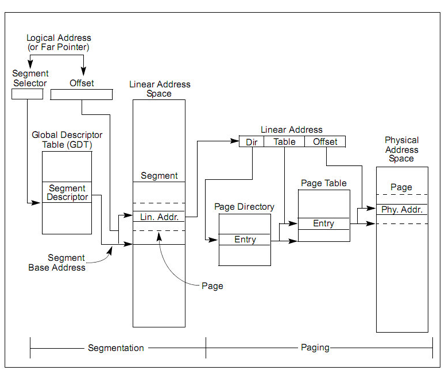

## 段页式管理基本概念

- 在保护模式中，x86体系将内存地址分为三种：逻辑地址（虚拟地址）、线性地址和物理地址。逻辑地址是程序指令中使用的地址，物理地址是实际访问的地址。逻辑地址通过段式管理的地址映射得到线性地址，线性地址通过页式管理的地址映射得到物理地址。

  

- 80X86中有一个CR0控制寄存器，它包含一个PG位，如果PG = 1，启用分页机制；如果PG = 0，禁用分页机制。不像分段机制管理大小不固定的内存，分页机制以固定大小的存储块为最小管理单位，即把整个地址空间包括线性地址和物理地址都看成由固定大小的存储块组成。在80X86中，这个固定大小一般设定为4096字节。在线性地址空间称为页（Page），物理空间（页帧）。页、页帧的32位地址由20的页号/页帧号和12位的页/页帧内偏移组成。
- 位何要采用多级页表？
  - 由于80X86的地址空间可达到4GB，按页大小（4KB）划分为1M个页。如果用一个页表来描述这种映射，那么就需要1M个表项，若每个表项占用4个字节，那么该映射表就要占用4M字节。考虑到每个进程就需要一个地址映射表，若有多个进程，那地址映射表所占的总空间将非常巨大。为避免地址映射表占用较多的内存空间，可以采用多级页表机制，80X86把映射表设定为两级。地址映射的第一级称为页目录表，存储在一个4K的物理页中，页目录表共有1K个表项，其中每个表项占用4字节长，页表项中包含对应第二级表所在的基地址。地址映射表的第二级称为页表，每个页表也安排在一个4K字节中的页中，每张页表项有1K的表项，每个表项为4字节长，包含页帧的基地址。