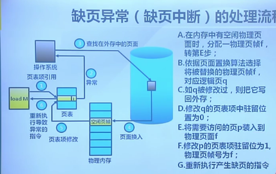
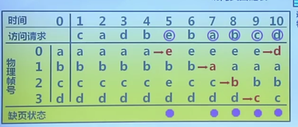
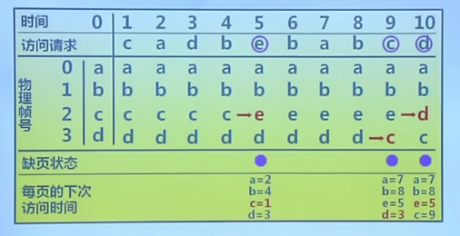

## 动机

- 增长迅速的存储需求

## 基本概念

- 思路
  - 将不常用的部分内存块暂存到外存

- 原理：

  - 装载程序时
    - **只将当前指令执行需要的部分页面或断装入内存**

  - 指令执行中需要的指令或数据不在内存（称为缺页）
    - **处理器通知操作系统将相应的页面或断调入内存**

  - 操作系统将内存中暂时不用的页面或段保存到外存

- 实现方式
  - 虚拟页式
  - 虚拟段式

## 基本特征

- 不连续性
  - 物理内存分配非连续
  - 虚拟地址空间使用非连续

- 大用户空间
  - 提供给用户的虚拟内存可大于实际的物理内存

- 部分交换
  - 虚拟存储只对部分虚拟地址空间进行调入和调出

## 技术支持

- 硬件
  - 页式或短时存储中的地址转换机制

- 操作系统
  - 管理内存和外存间页面或断的换入和换出

## 虚拟页式存储管理

- 在页式存储管理的基础上，增加请求调页和页面置换

- 思路

  - 当用户程序要装载到内存运行时，只装入部分页面，就启动程序运行

  - 进程在运行中发现有需要的代码或数据不在内存中时，则向系统发出缺页异常请求

  - 操作系统在处理缺页异常时，将外存中相应的页面调入内存中使得进程能继续运行

## 缺页异常

- 

- 如何保存未被映射的页？
  - 交换空间（Unix）

- 虚拟页式存储的外存选择
  - 代码段：可执行二进制空间
  - 动态加载的共享库程序段：动态调用
  - 其他段：交换空间

## 页面置换算法的概念

- 功能
  - 当出现缺页异常，需调入新页面而内存已满时，置换算法**选择被置换的物理页面**

- 设计目标
  - 尽可能减少页面的调入调出次数
  - 把未来不再访问或短期内不访问的页面调出

- 页面锁定
  - 描述必须常驻内存的逻辑页面
  - 操作系统的关键部分
  - 要求相应速度的代码和数据
  - 页表中的锁定标志位

## 最优页面置换算法

- 基本思路
  - 置换在未来最长时间不访问的页面

- 算法实现
  - 缺页时，计算内存中每个逻辑页面的下一次访问时间
  - 选择未来最长时间不访问的页面

- 算法特征

  - 缺页最少，理想情况
  - 实际系统中无法实现
  - 无法预知每个页面在下次访问前的等待时间

  - 作为置换算法的性能评价依据

## 先进先出算法

- 思路

  - 选择在**内存驻留时间最长的页面**继续置换

- 实现
  - 维护一个记录所有位于内存中的逻辑页面链表
  - 链表元素按驻留内存的时间排序，链首最长，链尾最短
  - 出现缺页时，选择链首页面继续置换，新页面加到链尾

- 特征

  - 实现简单
  - 性能较差，调出的页面可能是经常访问的
  - 进程分配物理页面数增加时，缺页并不会减少
  - 很少单独使用

  

## 最近最久未使用算法（LRU）

- 思路
  - 选择最长时间没有被引用的页面进行置换
  - 如某些页面长时间未被访问 ，则他们将来还可能会长时间不会访问

- 实现
  - 缺页时，计算内存中每个逻辑页面的上一次访问时间
  - 选择上一次使用到当前时间最长的页面



- LRU算法可能实现的方法

  - 页面链表

    - 系统维护一个按最近一次访问时间排序的页面链表
      - 链首节点是最近刚刚使用过的页面
      - 链表尾节点是最久未使用的页面
    - 访问内存时，找到相应页面，并把他移到链首之首

```c++
#include <unordered_map>
using namespace std;
struct ListNode1
{
    int key;
    int value;
    ListNode1* next;
    ListNode1* pre;
    ListNode1(int x , int y) : key(x) , value(y),next(nullptr),pre(nullptr)
    {}
};
class LRUCache
{
public:
    LRUCache(int capacity) 
    {
        nums = 0;
        head = nullptr;
        rear = nullptr;
        this->capacity = capacity;
        head = new ListNode1(0,0);
        rear = new ListNode1(0,0);
        head->next = rear;
        rear->pre =  head;
    }
    
    int get(int key) 
    {
        if(m_map[key])
        {
            ListNode1* node = m_map[key];
            int val = node->value;
            delNode(node);
            insertAfterHead(node);
            return node->value;
        }
        return -1;
    }
    
    void put(int key, int value) 
    {
        if(m_map[key])
        {
            ListNode1* node = m_map[key];
            delNode(node);
            node->value = value;
            insertAfterHead(node);
        }
        else
        {
            if(nums == capacity)
            {
                ListNode1* n = rear->pre;
                int k = n->key;
                delNode(n);
                m_map.erase(k);
                --nums;
                delete n;
            }
            ListNode1* new_node = new ListNode1(key,value);
            insertAfterHead(new_node);
            m_map[key] = new_node;
            ++nums;
        }
        
    }
    void insertAfterHead(ListNode1* node)
    {
        ListNode1* tmp = head->next;
        head->next = node;
        node->pre = head;
        node->next = tmp;
        tmp->pre   = node;
    }
    void delNode(ListNode1* node)
    {
        node->pre->next = node->next;
        node->next->pre = node->pre;
    }
private:
    int nums;
    int capacity;
    unordered_map<int , ListNode1*> m_map;
    ListNode1* head;
    ListNode1* rear;
};

```


## 时钟置换算法（Clock）

- 思路

  - 仅对页面的访问情况进行大致的统计

- 数据结构

  - 在页表项中增加**访问位**，描述页面在过去一段时间的内访问情况
  - 各页面组织成**环形链表**

  - **指针**指向最先调入的页面

- 算法
  - 访问页面时，在页表项记录页面访问情况
  - 缺页时，从指针开始顺序查找未被访问的页面进行置换

- 特征

  - 时钟算法是LRU和FIFO的折中

- 实现

  - 页面装入内存时，访问位初始化为0

  - 访问页面（读写）时，访问位置1

  - 缺页时，从指针当前位置顺序检查环形链表

    - 访问位为0，则置换该页

    - 访问位为1，则访问位置0，并将指针移到下一个页面，直到找到下一个可用的页面


## 改进的Clock算法

- 思路
  - 减少修改页的缺页处理开销

- 算法
  - 在页面中增加修改位，并在访问时进行相应修改
  - 缺页时，修改页面标志位，以跳过所有修改页面

## 最不常用算法(Least Frequently used)

- 思路
  - 缺页时，置换访问次数最少的页面

- 实现
  - 每个页面设置一个访问计数
  - 访问页面时，访问计数加1
  - 缺页时，置换计数最小的页面

- LRU和LFU的区别
  - LRU关注多久未访问，时间越短越好
  - LFU关注访问次数，次数越多越好