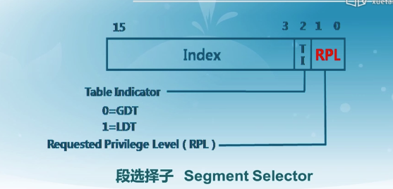
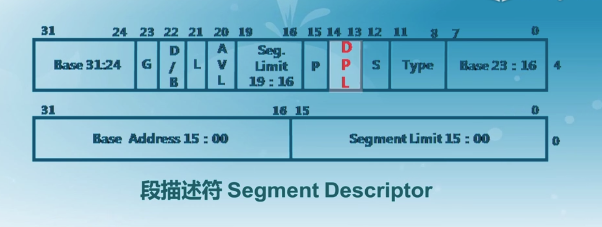
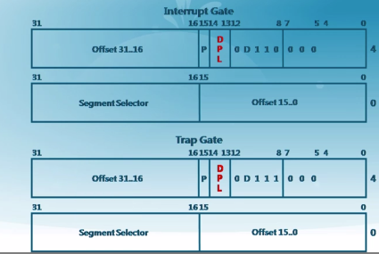
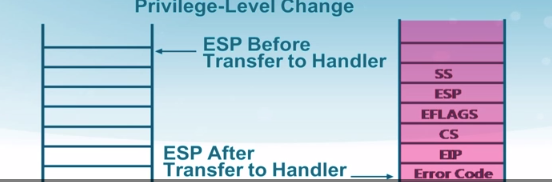
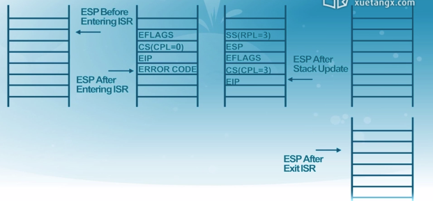
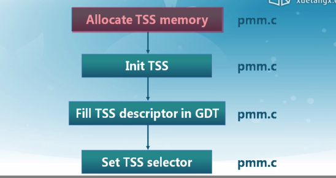

## X86特权级(privilege levels)

- Linux和Ucore只使用0和3

- 一些指令（比如特权指令）只能执行在ring 0(eg: lgdt)
- CPU在如下时刻会检查特权级
  - 访问数据段
  - 访问页
  - 进入中断服务例程(ISRS)
  - ...

- 段选择子

  - 

    ​		

- 段描述符中的DPL

  - 

- 中断门中的DPL

  - 

- 特权转移

  - 访问门时 CPL<=DPL[门] & CPL >= DPL[段]

  - 访问段时 MAX(CPL,RPL) <= DPL

## 通过中断切换特权级

- 
  - SS ES 被打断程序的堆栈信息

## 切换特权级(0 To 3)

- 构造一个特殊的栈
- 模仿ring3产生中断的地址
- 设置SS、CS的特权级
- IRET

- 

## 切换特权级(3 To 0)

- 软中断(trap)
- 中断服务例程
- 如果想不返回ring3
  - 删除SS、ESP
  - 设置CS的CPL = 0

- IRET

## TSS格式(Task-State-Segment)

- ring3跳到ring0 地址会发生变化，堆栈会发生变化。堆栈由TSS保存。
- 软件会将TSS填充

- 

## x86内存管理单元 MMU

- 段机制概述

