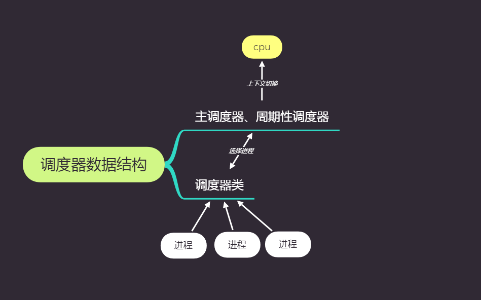

## 一些概念

- nice值

- 一个进程在一个调度周期中的运行时间

  - 分配给进程的运行时间 = 调度周期 * 进程权重  / 所有进程权重之和

- 一个进程虚拟运行时间与实际运行时间的关系

  - vruntime = 实际运行时间 * NICE_0_LOAD / 进程权重

    **进程权重越大，运行同样的实际时间，vruntime增长的越慢**

- 一个进程在一个调度周期内的虚拟运行时间

  - vruntime = 进程在一个调度周期内的实际运行时间 * NICE_0_LOAD / 进程权重

    ​		 = 调度周期 * NICE_0_LOAD / 所有进程的总权重

  - **一个进程在一个调度周期内的vruntime值大小和自己的权重无关，所有的进程的vruntime值大小都是一样的**

## 总体调度架构



​					

# CFS调度器类

##  动机

- **公平调度**

  - 若存在完美多任务处理器，每个进程可以运行同样多的时间。

  - 单单从nice值来计算时间片有很大缺陷。

# 实现

### 时间记录

- 每个进程(struct task_struct)中嵌入了调度实体struct sched_entity.

  ```c
  struct sched_entity {
  	struct load_weight	load;		/* for load-balancing */
  	struct rb_node		run_node;
  	struct list_head	group_node;
  	unsigned int		on_rq;
  
  	u64			exec_start;
  	u64			sum_exec_runtime;
  	u64			vruntime;
  	u64			prev_sum_exec_runtime;
  
  	u64			nr_migrations;
      //...
  };
  ```

  load记录了该调度实体的权重

- vruntime计算

  - updata_curr()计算出该实体的物理实际运行时间(由周期性调度器执行).

  - __updata_curr()计算当前运行进程的vruntime

### 进程选择

- 核心：选择有最小vruntime的任务

- CFS使用红黑树来组织进程队列，并迅速找到最小vruntime的进程。

  - 从树中插入进程

    ```c
    static void __enqueue_entity(struct cfs_rq *cfs_rq, struct sched_entity *se)
    {
    	struct rb_node **link = &cfs_rq->tasks_timeline.rb_node;
    	struct rb_node *parent = NULL;
    	struct sched_entity *entry;
    	int leftmost = 1;
    
    	/*
    	 * Find the right place in the rbtree:
    	 */
    	while (*link) {
    		parent = *link;
    		entry = rb_entry(parent, struct sched_entity, run_node);
    		/*
    		 * We dont care about collisions. Nodes with
    		 * the same key stay together.
    		 */
    		if (entity_before(se, entry)) {
    			link = &parent->rb_left;
    		} else {
    			link = &parent->rb_right;
    			leftmost = 0;
    		}
    	}
    
    	/*
    	 * Maintain a cache of leftmost tree entries (it is frequently
    	 * used):
    	 */
    	if (leftmost)
    		cfs_rq->rb_leftmost = &se->run_node;
    
    	rb_link_node(&se->run_node, parent, link);
    	rb_insert_color(&se->run_node, &cfs_rq->tasks_timeline);
    }
    
    ```

  - 从树中删除进程

    ```c++
    static void __dequeue_entity(struct cfs_rq *cfs_rq, struct sched_entity *se)
    {
    	if (cfs_rq->rb_leftmost == &se->run_node) {
    		struct rb_node *next_node;
    
    		next_node = rb_next(&se->run_node);
    		cfs_rq->rb_leftmost = next_node;
    	}
    
    	rb_erase(&se->run_node, &cfs_rq->tasks_timeline);
    }
    ```

  - 选择进程

    ```c
    static struct sched_entity *__pick_first_entity(struct cfs_rq *cfs_rq)
    {
    	struct rb_node *left = cfs_rq->rb_leftmost;
    
    	if (!left)
    		return NULL;
    
    	return rb_entry(left, struct sched_entity, run_node);
    }
    ```

### 与主调度器关联

- 进程调度主调函数为schedule(),所有调度器类中的高优先级进程由schedule()来与切换
- CFS只是普通调度器类适用于普通进程

### 睡眠与唤醒

- 等待队列
  - 等待队列是由某些事件(I/O)发生的进程组成的链表

- 唤醒
  - try_to_wake_up() wake_up 当网卡中有包到达等等hi调用wake_up()，然后将此进程加入红黑树中

