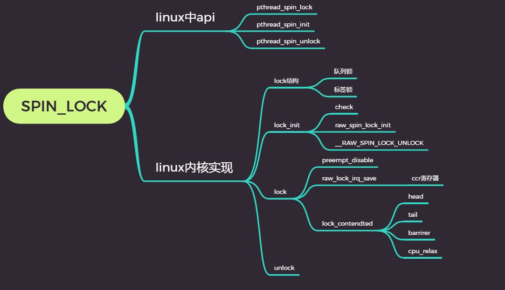

## 内核中锁的类型

- 原子操作：保证简单的操作，例如计数器加1，可以不中断地原子执行
- 自旋锁：用于短期保护某段代码，未获得锁不会投入睡眠
- 信号量：等待信号量释放时，内核会进入睡眠
- 读者/写者锁：读共享、写独占。

## 自旋锁

### linux中api

- pthread_spin_destroy()

- pthread_spin_lock()
- pthread_spin_unlock()
- pthread_spin_trylock()

- pthread_spin_init()

### 一般自旋锁设计

- 正常自旋锁的实现是基于test   and  set指令。该指令写入一个值到内存地址然后返回该地址的旧值。这些操作都是在原子的上下文中完成，指令不可中断。

- ```c
  int lock(lock)
  {
      while(test_and_set(lock) == 1)
      ;
      return 0;
  }
  int unlock(lock)
  {
      lock = 0;
      return lock;
  }
  ```

  > 当第一个线程执行test and set 指令设置lock为1，第二个线程调用lock函数并在while中自旋，直到第一个线程调用unlock函数而且lock = 0.这个实现对于执行不是很友好，因为该实现至少有两个问题。第一个问题是该实现可能是非公平的而且一个处理器的线程可能等待很长时间，即使有其他线程也在等待释放锁，它还是调用了lock。第二个问题是所有想要获取锁的线程必须在共享内存变量上执行testandset原子操作。这导致缓存失效，因为处理器缓存lock = 1，在线程释放锁之后，内存lock可能还是1.

### spin_lock结构

- ```c++
  typedef struct spinlock {
  	union {
  		struct raw_spinlock rlock;
  	};
  }spinlock_t;
  //
  typedef struct raw_spinlock {
  	arch_spinlock_t raw_lock;
  } raw_spinlock_t;
  //.....
  #ifdef CONFIG_QUEUED_SPINLOCKS
  #include <asm-generic/qspinlock_types.h>
  #else
  typedef struct arch_spinlock {
          union {
                  __ticketpair_t head_tail;
                  struct __raw_tickets {
                          __ticket_t head, tail;
                  } tickets;
          };
  } arch_spinlock_t;
  //...
  typedef struct qspinlock {
  	atomic_t	val;
  } arch_spinlock_t;
  ```

### spin_lock_init

- ```c++
  #define spin_lock_init(_lock)				\
  do {							\
  	spinlock_check(_lock);				\
  	raw_spin_lock_init(&(_lock)->rlock);		\
  } while (0)
  ```

- ```c++
  # define raw_spin_lock_init(lock)		\
  do {                                                  \
      *(lock) = __RAW_SPIN_LOCK_UNLOCKED(lock);         \
  } while (0)   
  ```

### spin_lock

- ```c
  static __always_inline void spin_lock(spinlock_t *lock)
  {
  	raw_spin_lock(&lock->rlock);
  }
  ```

- ```c++
  static inline void __raw_spin_lock(raw_spinlock_t *lock)
  {
          preempt_disable();//屏蔽抢占
          spin_acquire(&lock->dep_map, 0, 0, _RET_IP_);
          LOCK_CONTENDED(lock, do_raw_spin_trylock, do_raw_spin_lock);
  }
  ```

- ```
  #define spin_acquire(l, s, t, i)                lock_acquire_exclusive(l, s, t, NULL, i)
  #define lock_acquire_exclusive(l, s, t, n, i)           lock_acquire(l, s, t, 0, 1, n, i)
  ```

- ```c
  void lock_acquire(struct lockdep_map *lock, unsigned int subclass,
                    int trylock, int read, int check,
                    struct lockdep_map *nest_lock, unsigned long ip)
  {
           unsigned long flags;
  
           if (unlikely(current->lockdep_recursion))
                  return;
  
           raw_local_irq_save(flags);
           check_flags(flags);
  
           current->lockdep_recursion = 1;
           trace_lock_acquire(lock, subclass, trylock, read, check, nest_lock, ip);
           __lock_acquire(lock, subclass, trylock, read, check,
                          irqs_disabled_flags(flags), nest_lock, ip, 0, 0);
           current->lockdep_recursion = 0;
           raw_local_irq_restore(flags);
  }
  ```

  > raw_local_irq_save屏蔽硬件中断
  >
  > raw_local_irq_restore 取消硬件中断
  >
  > ```c
  > static inline void arch_local_irq_restore(unsigned long flags)
  > {
  > 	asm volatile("move %0,$ccr" : : "rm" (flags) : "memory");
  > }
  > ```
  >
  > gcc内联汇编 volatile：编译器不做指令优化 move：传送指令 %0：第一个寄存器 ccr:中断寄存器 rm：读写操作
  >
  >  memory强制gcc编译器假设RAM所有内存单元均被汇编指令修改，这样cpu中的registers和cache中已缓存的内存单元中的数据将作废。cpu将不得不在需要的时候重新读取内存中的数据。这就阻止了cpu又将registers，cache中的数据用于去优化指令，而避免去访问内存。

- LOCK_CONTENDED

  ```c
  #define LOCK_CONTENDED(_lock, try, lock) \
           lock(_lock)
  ```

  ```c
  static inline void do_raw_spin_lock(raw_spinlock_t *lock) __acquires(lock)
  {
          __acquire(lock);
           arch_spin_lock(&lock->raw_lock);
  }
  ```

  只关注arch_spin_lock,arch_spin_lock函数依赖于系统架构和是否使用了队列自旋锁。暂不考虑队列自旋锁。

  普通自旋锁

  ```c++
  typedef struct arch_spinlock {
           union {
                  __ticketpair_t head_tail;
                  struct __raw_tickets {
                          __ticket_t head, tail;
                  } tickets;
          };
  } arch_spinlock_t;
  ```

  普通进程在加锁（普通自旋锁）失败后在做什么呢？来看看arch_spin_lock

  ```c++
  static __always_inline void arch_spin_lock(arch_spinlock_t* lock)
  {
      register struct __raw_tickets inc = {.tail = TICKET_LOCK_INC };
      inc = xadd(&lock->tickets,inc);
      if(likely(inc.head == inc.tail))
          goto out;
      for(;;){
          unsigned count = SPIN_THRESHOLD;
          do{
              inc.head = READ_ONCE(lock->tickets.head);
              if(__tickets_equal(inc.head,inc.tail))
                  goto clear_slowpath;
              cpu_relax();
          }while(--count);
          __ticket_lock_spinning(lock,in.tail);
      }
  clear_slowpath:
      	__ticket_check_and_clear_slowpath(lock,inc.head);
  out:
      barrier();
  }
  ```

  > linux使用goto语言... 一开始使用尾部对__raw_tickets结构初始化 xadd之后inc将存储给定tickets的值，tickets.tail将增加inc.尾部增加1表示一个程序开始尝试持有锁如果head == tail 会跳转到out出口。那么barrier又是什么？(asm volatile("" : : : "memory"）是不是似曾相识）
  >
  > 如果head != tail 这时进程在干什么？ 
  >
  > 该进程将会进入死循环 循环检测head是否等于tail，如果相等则跳出
  >
  > 不相等会执行cpu_relax()   (  asm volatile("rep; nop") )

### spin_unlock

- ```c
  static inline void __raw_spin_unlock(raw_spinlock_t *lock)
  {
  	spin_release(&lock->dep_map, 1, _RET_IP_);
  	do_raw_spin_unlock(lock);
  	preempt_enable();
  }
  ```


- ```c
  
  static inline void arch_local_irq_restore(unsigned long flags)
  {
  	asm volatile("move %0,$ccr" : : "rm" (flags) : "memory");
  }
  ```

- ```
  __add(&lock->tickets.head, TICKET_LOCK_INC, UNLOCK_LOCK_PREFIX);
  ```


在spin_lock和spin_unlock的组合使用中，我们得到一个队列，其头部包含一个索引号，映射了当前执行的持有锁的程序，尾部包含一个索引号，映射了所有尝试持有锁的程序。解决了普通自旋锁中线程顺序。




​     