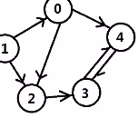
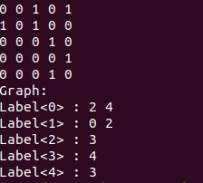

## 两种表示方法



- ```C++
  #include <iostream>
  #include <vector>
  using namespace std
  struct GraphNode
  {
      int label;
      vector<GraphNode*> neighbors;
      GraphNode(int x):
      label(x)
      {}
  };
  class graph
  {
  public:
      void constructGraph1()
      {
          const int MAX_N = 5;
          int Graph[MAX_N][MAX_N] = {0};
          Graph[0][2] = 1;
          Graph[0][4] = 1;
          Graph[1][0] = 1;
          Graph[1][2] = 1;
          Graph[2][3] = 1;
          Graph[3][4] = 1;
          Graph[4][3] = 1;
          cout<<endl;
          for(int i = 0 ; i < MAX_N ; i++)
          {
              for(int j = 0 ; j < MAX_N ; j++)
              {
                  cout<<Graph[i][j]<<" ";
              }
              cout<<endl;
          }
          return ;
      }
      void constructGraph2()
      {
          const int MAX_N = 5;
          GraphNode* Graph[MAX_N];
          for(int i = 0 ; i < MAX_N ; i++)
          {
              Graph[i] = new GraphNode(i);
          }
          Graph[0]->neighbors.push_back(Graph[2]);
          Graph[0]->neighbors.push_back(Graph[4]);
          Graph[1]->neighbors.push_back(Graph[0]);
          Graph[1]->neighbors.push_back(Graph[2]);
          Graph[2]->neighbors.push_back(Graph[3]);
          Graph[3]->neighbors.push_back(Graph[4]);
          Graph[4]->neighbors.push_back(Graph[3]);
          cout<<"Graph: "<<endl;
          for(int i = 0 ; i < MAX_N ; i++)
          {
              cout<<"Label<"<<i<<"> : ";
              for(int j = 0 ; j < Graph[i]->neighbors.size() ; j++)
              {
                  cout<<Graph[i]->neighbors[j]->label <<" ";
              }
              cout<<endl;
          }
          for(int i = 0 ; i < MAX_N ; i++)
          {
              delete Graph[i];
          }
      }
  };
  int main()
  {
      graph a;
      a.constructGraph1();
      a.constructGraph2();
      return 0;
  };
  struct GraphNode
  {
      int label;
      vector<GraphNode*> neighbors;
      GraphNode(int x):
      label(x)
      {}
  };
  class graph
  {
  public:
      void constructGraph1()
      {
          const int MAX_N = 5;
          int Graph[MAX_N][MAX_N] = {0};
          Graph[0][2] = 1;
          Graph[0][4] = 1;
          Graph[1][0] = 1;
          Graph[1][2] = 1;
          Graph[2][3] = 1;
          Graph[3][4] = 1;
          Graph[4][3] = 1;
          cout<<endl;
          for(int i = 0 ; i < MAX_N ; i++)
          {
              for(int j = 0 ; j < MAX_N ; j++)
              {
                  cout<<Graph[i][j]<<" ";
              }
              cout<<endl;
          }
          return ;
      }
      void constructGraph2()
      {
          const int MAX_N = 5;
          GraphNode* Graph[MAX_N];
          for(int i = 0 ; i < MAX_N ; i++)
          {
              Graph[i] = new GraphNode(i);
          }
          Graph[0]->neighbors.push_back(Graph[2]);
          Graph[0]->neighbors.push_back(Graph[4]);
          Graph[1]->neighbors.push_back(Graph[0]);
          Graph[1]->neighbors.push_back(Graph[2]);
          Graph[2]->neighbors.push_back(Graph[3]);
          Graph[3]->neighbors.push_back(Graph[4]);
          Graph[4]->neighbors.push_back(Graph[3]);
          cout<<"Graph: "<<endl;
          for(int i = 0 ; i < MAX_N ; i++)
          {
              cout<<"Label<"<<i<<"> : ";
              for(int j = 0 ; j < Graph[i]->neighbors.size() ; j++)
              {
                  cout<<Graph[i]->neighbors[j]->label <<" ";
              }
              cout<<endl;
          }
          for(int i = 0 ; i < MAX_N ; i++)
          {
              delete Graph[i];
          }
      }
  };
  int main()
  {
      graph a;
      a.constructGraph1();
      a.constructGraph2();
      return 0;
  }
  
  ```

  

#### [207. Course Schedule](https://leetcode-cn.com/problems/course-schedule/)

- ```c++
  #include <iostream>
  #include <vector>
  using namespace std;
  struct GraphNode
  {
      int label;
      vector<GraphNode*> neighbors;
      GraphNode(int x): label(x)
      {}
  };
  class Solution 
  {
  public:
      bool dfs_graph(GraphNode* node , vector<int>& visit)
      {
          visit[node->label] = 0 ;
          for(int i = 0 ; i < node->neighbors.size() ; i++)
          {
              if(visit[node->neighbors[i]->label] == -1)
              {
                  if(dfs_graph(node->neighbors[i],visit) == 0)
                  {
                      return false;
                  }
              }
              else if(visit[node->neighbors[i]->label] == 0)
              {
                  return false;
              }
          }
          visit[node->label] = 1;
          return true;
      }
      bool canFinish(int numCourses, vector<pair<int, int>>& prerequisites)
      {
          vector<GraphNode*> graph;
          vector<int> visit;//-1未访问，0正在访问，1已完成访问
          for(int i = 0 ; i < numCourses; i++)
          {
              graph.push_back(new GraphNode(i));
              visit.push_back(-1);
          }
          for(int i = 0 ; i < prerequisites.size() ; i++)
          {
              GraphNode* begin = graph[prerequisites[i].second];
              GraphNode* end   = graph[prerequisites[i].first];
              begin->neighbors.push_back(end);
          }
          for(int i =0 ; i < graph.size() ; i++)
          {
              if(visit[i] == -1 && !dfs_graph(graph[i],visit))
              {
                  return false;
              }
          }
          for(int i =9 ; i < numCourses ; i++)
          {
              delete graph[i];
          }
          return true;
      }
  };
  ```

  
