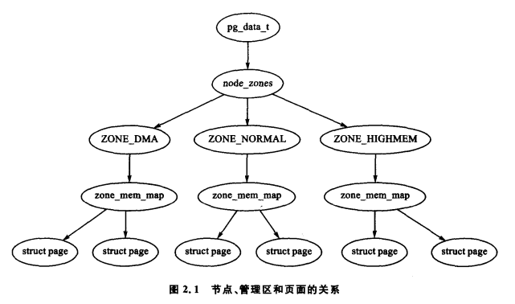

## 描述物理内存

- NUMA模型


- - 一台计算机有多个Node，每个节点有多个core，上图中是4个核，在每个节点内存中都有自己的内存，称为本地内存。在本地内存相对的是远端内存，对于node0来说，node1、node2、node3中的内存都是远端内存。在节点中，CPU与内存之间通过片内总线进行连接。各个节点之间通过互联模块进行连接。NUMA节点中CPU对节点内部内存与节点外部内存的访问是有差异的。

- **节点、管理区和页面的关系**

  

- **节点**

  - 内存中的每个节点都由pg_data_t描述，而pg_data_t由struct  pglist_data 定义而来。

    ```c
    //<include/linux/mmzone.h>
    struct bootmem_data;
    typedef struct pglist_data {
    	zone_t node_zones[MAX_NR_ZONES];
    	zonelist_t node_zonelists[GFP_ZONEMASK+1];
    	int nr_zones;
    	struct page *node_mem_map;
    	unsigned long *valid_addr_bitmap;
    	struct bootmem_data *bdata;//内存引导程序
    	unsigned long node_start_paddr;//节点起始物理地址
    	unsigned long node_start_mapnr;//节点在全局mem_map中的页面偏移
    	unsigned long node_size;
    	int node_id;
    	struct pglist_data *node_next;
    } pg_data_t;
    ```

- **管理区**

  - 每个管理区由struct zone_t 描述。zone_structs用于跟踪诸如页面使用情况统计数，空闲区域信息和锁信息。

    ```c
    typedef struct zone_struct {
    	/*
    	 * Commonly accessed fields:
    	 */
    	spinlock_t		lock;
    	unsigned long		free_pages;
    	unsigned long		pages_min, pages_low, pages_high;
    	int			need_balance;
    
    	/*
    	 * free areas of different sizes
    	 */
    	free_area_t		free_area[MAX_ORDER];
    
    	/*
    	 * wait_table		-- the array holding the hash table
    	 * wait_table_size	-- the size of the hash table array
    	 * wait_table_shift	-- wait_table_size
    	 * 				== BITS_PER_LONG (1 << wait_table_bits)
    	 *
    	 * The purpose of all these is to keep track of the people
    	 * waiting for a page to become available and make them
    	 * runnable again when possible. The trouble is that this
    	 * consumes a lot of space, especially when so few things
    	 * wait on pages at a given time. So instead of using
    	 * per-page waitqueues, we use a waitqueue hash table.
    	 *
    	 * The bucket discipline is to sleep on the same queue when
    	 * colliding and wake all in that wait queue when removing.
    	 * When something wakes, it must check to be sure its page is
    	 * truly available, a la thundering herd. The cost of a
    	 * collision is great, but given the expected load of the
    	 * table, they should be so rare as to be outweighed by the
    	 * benefits from the saved space.
    	 *
    	 * __wait_on_page() and unlock_page() in mm/filemap.c, are the
    	 * primary users of these fields, and in mm/page_alloc.c
    	 * free_area_init_core() performs the initialization of them.
    	 */
    	wait_queue_head_t	* wait_table;
    	unsigned long		wait_table_size;
    	unsigned long		wait_table_shift;
    
    	/*
    	 * Discontig memory support fields.
    	 */
    	struct pglist_data	*zone_pgdat;
    	struct page		*zone_mem_map;
    	unsigned long		zone_start_paddr;
    	unsigned long		zone_start_mapnr;
    
    	/*
    	 * rarely used fields:
    	 */
    	char			*name;
    	unsigned long		size;
    } zone_t;
    
    ```

    free_pages：该管理区中空闲页的总数

    pages_min,pages_low,pages_high:这些都是管理区极值

    need_balance：该标志位通知页面换出kswapd平衡该管理区。当可用页面的数量达到管理区极值的某一个值时，就需要平衡该管理区了

    free_area：空闲区域位图，由伙伴系统使用

- **管理区等待列表**

  - 当页面需要进行I/O操作时，比如页面换入换出,I/O必须被锁住以防止访问到不一致的数据。使用这些页面的进程必须在I/O能访问以前，通过调用wait_on_page()被添加到一个等待队列中。当I/O 完成后，页面通过UnlockPage()解锁，然后等待队列上的每个进程都被唤醒。linux将等待队列的哈希表存储在wait->table中。在发生哈希冲突时，虽然进程也有可能会被唤醒，但不会发生如此频繁。

- mem_map

  - mem_map区域在NUMA系统中，全局mem_map被处理为一个起始于PAGE_OFFSET的虚拟数组。free_area_init_node()函数在系统中被每一个活动节点所调用。

    ```c
    void __init free_area_init_node(int nid, pg_data_t *pgdat, struct page *pmap,
    	unsigned long *zones_size, unsigned long zone_start_paddr, 
    	unsigned long *zholes_size)
    {
    	int i, size = 0;
    	struct page *discard;
    
    	if (mem_map == (mem_map_t *)NULL)
    		mem_map = (mem_map_t *)PAGE_OFFSET;
    
    	free_area_init_core(nid, pgdat, &discard, zones_size, zone_start_paddr,zholes_size, pmap);
    	pgdat->node_id = nid;
    
    	/*
    	 * Get space for the valid bitmap.
    	 */
    	for (i = 0; i < MAX_NR_ZONES; i++)
    		size += zones_size[i];
    	size = LONG_ALIGN((size + 7) >> 3);
    	pgdat->valid_addr_bitmap = (unsigned long *)alloc_bootmem_node(pgdat, size);
    	memset(pgdat->valid_addr_bitmap, 0, size);
    }
    ```

  - NUMA中，分配给lmem_map的内存在他们自己的内存节点中。全局mem_map起始于PAGE_OFFSET的虚拟数组。局部映射的地址存储在pg_data_t->node_mem_map中，也存在于虚拟mem_map中。

    ```c
    void __init free_area_init_core(int nid, pg_data_t *pgdat, struct page **gmap,
    	unsigned long *zones_size, unsigned long zone_start_paddr, 
    	unsigned long *zholes_size, struct page *lmem_map)
    {
        //...
        lmem_map = (struct page *) alloc_bootmem_node(pgdat, map_size);
    }
    ```

- 页面

  - ```c
    typedef struct page {
    	struct list_head list;		/* ->mapping has some page lists. */
    	struct address_space *mapping;	/* The inode (or ...) we belong to. */
    	unsigned long index;		/* Our offset within mapping. */
    	struct page *next_hash;		/* Next page sharing our hash bucket in
    					   the pagecache hash table. */
    	atomic_t count;			/* Usage count, see below. */
    	unsigned long flags;		/* atomic flags, some possibly
    					   updated asynchronously */
    	struct list_head lru;		/* Pageout list, eg. active_list;
    					   protected by pagemap_lru_lock !! */
    	struct page **pprev_hash;	/* Complement to *next_hash. */
    	struct buffer_head * buffers;	/* Buffer maps us to a disk block. */
    
    	/*
    	 * On machines where all RAM is mapped into kernel address space,
    	 * we can simply calculate the virtual address. On machines with
    	 * highmem some memory is mapped into kernel virtual memory
    	 * dynamically, so we need a place to store that address.
    	 * Note that this field could be 16 bits on x86 ... ;)
    	 *
    	 * Architectures with slow multiplication can define
    	 * WANT_PAGE_VIRTUAL in asm/page.h
    	 */
    #if defined(CONFIG_HIGHMEM) || defined(WANT_PAGE_VIRTUAL)
    	void *virtual;			/* Kernel virtual address (NULL if
    					   not kmapped, ie. highmem) */
    #endif /* CONFIG_HIGMEM || WANT_PAGE_VIRTUAL */
    } mem_map_t;
    ```

## 页表管理

- 描述页目录

  - 进程中都有一个指向自己的PGD(页目录项 一级页表)，本质是一个物理页帧。该帧包括了一个pgd_t类型的数组，进程页表载入是通过mm_sturct->pgd复制 到cr3寄存器完成。

    - ```c
      struct mm_struct {    //内存描述符  
      	struct vm_area_struct * mmap;		/* list of VMAs */
      	rb_root_t mm_rb;
      	struct vm_area_struct * mmap_cache;	/* last find_vma result */
      	pgd_t * pgd;
      	atomic_t mm_users;			/* How many users with user space? */
      	atomic_t mm_count;			/* How many references to "struct mm_struct" (users count as 1) */
      	int map_count;				/* number of VMAs */
      	struct rw_semaphore mmap_sem;
      	spinlock_t page_table_lock;		/* Protects task page tables and mm->rss */
      
      	struct list_head mmlist;		/* List of all active mm's.  These are globally strung
      						 * together off init_mm.mmlist, and are protected
      						 * by mmlist_lock
      						 */
      
      	unsigned long start_code, end_code, start_data, end_data;
      	unsigned long start_brk, brk, start_stack;
      	unsigned long arg_start, arg_end, env_start, env_end;
      	unsigned long rss, total_vm, locked_vm;
      	unsigned long def_flags;
      	unsigned long cpu_vm_mask;
      	unsigned long swap_address;
      
      	unsigned dumpable:1;
      
      	/* Architecture-specific MM context */
      	mm_context_t context;
      };
      ```

    - 

- ```C
  #define PAGE_SHIFT 12
  #define PAGE_SIZE (1UL << PAGE_SHIFT)
  #define PAGE_MASK (~(PAGE_SIZE - 1))
  ```

  

- 描述页表项

  - PTE，PMD，PGD分别由pte_t,pmd_t,pgd_t描述。

  ```C
  _PAGE_PRESENT //页面常驻内存，不进行换出操作
  _PAGE_PROTNONE //页面常驻内存，但不可访问
  _PAGE_RW       //页面可能被写入时设置该位
  _PAGE_USER     //页面可以被用户空间访问时设置该位
  _PAGE_DIRTY	   //页面被写入时设置该位
  _PAGE_ACCESSED  //页面被访问时设置该位
  ```

- 物理和虚拟内核地址之间的映射

  可以简单地将任意一个虚拟地址减去PAGE_OFFSET而获得物理地址

  ```c
  #define __pa(x)                 ((unsigned long)(x) - PAGE_OFFSET)
  ```

- struct page 和物理地址间的映射

  系统将映像装载到1MB物理地址起始位置，这个物理地址就是PAGE_OFFSET+0x00100000.真正被内核分配使用的内存起始位置应在0xC10000000,这个位置即为全局mem_map所在的位置。

## 进程地址空间

虚拟内存让每个进程都有属于自己的虚拟地址空间，这种空间可以通过操作系统映射到物理内存。

内核在处理用户地址空间和内核空间上有很大的不同。内核空间的分配不管此时CPU运行何种进程，都可以很快得到满足，他对整个系统是全局性的。

用户空间在上下文切换后，TLB和用户空间的内容都可能发生变换，内核必须能够捕捉用户空间中的异常并定位用户空间的错误

- 线性地址空间

  - 地址空间分为两个部分，一个是随上下文切换而改变的用户空间部分，一个是保持不变的内核空间部分。

  

  - vmallloc

    vmalloc分配的内存只是线性地址连续，物理地址不一定连续，不能直接用于DMA。分配的内存虚拟地址是连续的，而物理地址则无需连续。通过vmalloc获得的页必须一个一个地映射，效率不高。


- 进程地址空间的管理

  - 进程可使用的地址空间由mm_struct管理

  ```c
  struct mm_struct {
  	struct vm_area_struct * mmap;		/* list of VMAs */
  	rb_root_t mm_rb;
  	struct vm_area_struct * mmap_cache;	/* last find_vma result */
  	pgd_t * pgd;
  	atomic_t mm_users;			/* How many users with user space? */
  	atomic_t mm_count;			/* How many references to "struct mm_struct" (users count as 1) */
  	int map_count;				/* number of VMAs */
  	struct rw_semaphore mmap_sem;
  	spinlock_t page_table_lock;		/* Protects task page tables and mm->rss */
  
  	struct list_head mmlist;		/* List of all active mm's.  These are globally strung
  						 * together off init_mm.mmlist, and are protected
  						 * by mmlist_lock
  						 */
  
  	unsigned long start_code, end_code, start_data, end_data;
  	unsigned long start_brk, brk, start_stack;
  	unsigned long arg_start, arg_end, env_start, env_end;
  	unsigned long rss, total_vm, locked_vm;
  	unsigned long def_flags;
  	unsigned long cpu_vm_mask;
  	unsigned long swap_address;
  
  	unsigned dumpable:1;
  
  	/* Architecture-specific MM context */
  	mm_context_t context;
  };
  ```

  - 内存集合struct vm_area_struct

  ```c
  /*
   * This struct defines a memory VMM memory area. There is one of these
   * per VM-area/task.  A VM area is any part of the process virtual memory
   * space that has a special rule for the page-fault handlers (ie a shared
   * library, the executable area etc).
   */
  struct vm_area_struct {
  	struct mm_struct * vm_mm;	/* The address space we belong to. */
  	unsigned long vm_start;		/* Our start address within vm_mm. */
  	unsigned long vm_end;		/* The first byte after our end address
  					   within vm_mm. */
  
  	/* linked list of VM areas per task, sorted by address */
  	struct vm_area_struct *vm_next;
  
  	pgprot_t vm_page_prot;		/* Access permissions of this VMA. */
  	unsigned long vm_flags;		/* Flags, listed below. */
  
  	rb_node_t vm_rb;
  
  	/*
  	 * For areas with an address space and backing store,
  	 * one of the address_space->i_mmap{,shared} lists,
  	 * for shm areas, the list of attaches, otherwise unused.
  	 */
  	struct vm_area_struct *vm_next_share;
  	struct vm_area_struct **vm_pprev_share;
  
  	/* Function pointers to deal with this struct. */
  	struct vm_operations_struct * vm_ops;
  
  	/* Information about our backing store: */
  	unsigned long vm_pgoff;		/* Offset (within vm_file) in PAGE_SIZE
  					   units, *not* PAGE_CACHE_SIZE */
  	struct file * vm_file;		/* File we map to (can be NULL). */
  	unsigned long vm_raend;		/* XXX: put full readahead info here. */
  	void * vm_private_data;		/* was vm_pte (shared mem) */
  };
  
  ```

  - 内存相关的系统调用

    - fork(): 创建一个具有新地址空间的进程，所有的页面都标记上写时复制（COW）,并且在页面中断以前一直由两个进程所共享，一旦发生写错误，则为此错误进程复制COW页面。
    - clone():clone()允许创建一个共享上下文给父进程的新进程，这在linux中就是线程的实现。如果没有设置CLONE_VM位，则clone()将创建一个新的地址空间。其作用和fork()一样

    - mmap():mmap()在进程线性地址空间中创建一个新区域

    

- 进程地址空间描述符

  ```c
  struct mm_struct {
  	struct vm_area_struct * mmap;		/* list of VMAs */
  	rb_root_t mm_rb;
  	struct vm_area_struct * mmap_cache;	/* last find_vma result */
  	pgd_t * pgd;
  	atomic_t mm_users;			/* How many users with user space? */
  	atomic_t mm_count;			/* How many references to "struct mm_struct" (users count as 1) */
  	int map_count;				/* number of VMAs */
  	struct rw_semaphore mmap_sem;
  	spinlock_t page_table_lock;		/* Protects task page tables and mm->rss */
  
  	struct list_head mmlist;		/* List of all active mm's.  These are globally strung
  						 * together off init_mm.mmlist, and are protected
  						 * by mmlist_lock
  						 */
  
  	unsigned long start_code, end_code, start_data, end_data;
  	unsigned long start_brk, brk, start_stack;
  	unsigned long arg_start, arg_end, env_start, env_end;
  	unsigned long rss, total_vm, locked_vm;
  	unsigned long def_flags;
  	unsigned long cpu_vm_mask;
  	unsigned long swap_address;
  
  	unsigned dumpable:1;
  
  	/* Architecture-specific MM context */
  	mm_context_t context;
  };
  ```

  
  - mmap VMA: 地址空间中所有VMA的链表首部
  - mm_rb VMA:VMA排列在链表中，存放在红黑树中，该字段表示树的根部
  - pgd:全局目录表的起始位置

  - 分配一个描述符
    - mm_alloc(从slab中分配，然后调用mm_init初始化)

- VMA虚拟内存区域

  一个vma(virtual memory areas)就是一块连续的线性地址空间的抽象

  ```c
  struct vm_area_struct {
  	struct mm_struct * vm_mm;	/* The address space we belong to. */
  	unsigned long vm_start;		/* Our start address within vm_mm. */
  	unsigned long vm_end;		/* The first byte after our end address
  					   within vm_mm. */
  
  	/* linked list of VM areas per task, sorted by address */
  	struct vm_area_struct *vm_next;
  
  	pgprot_t vm_page_prot;		/* Access permissions of this VMA. */
  	unsigned long vm_flags;		/* Flags, listed below. */
  
  	rb_node_t vm_rb;
  
  	/*
  	 * For areas with an address space and backing store,
  	 * one of the address_space->i_mmap{,shared} lists,
  	 * for shm areas, the list of attaches, otherwise unused.
  	 */
  	struct vm_area_struct *vm_next_share;
  	struct vm_area_struct **vm_pprev_share;
  
  	/* Function pointers to deal with this struct. */
  	struct vm_operations_struct * vm_ops;
  
  	/* Information about our backing store: */
  	unsigned long vm_pgoff;		/* Offset (within vm_file) in PAGE_SIZE
  					   units, *not* PAGE_CACHE_SIZE */
  	struct file * vm_file;		/* File we map to (can be NULL). */
  	unsigned long vm_raend;		/* XXX: put full readahead info here. */
  	void * vm_private_data;		/* was vm_pte (shared mem) */
  };
  
  ```

  - 较高层次的结构的vm_area_structs 是由双向链表连接起来的，他们是按虚地址的降顺序来排列的，每个这样的结构都对应描述一个相邻的地址空间范围。之所以这样分割，是因为每个虚拟区间可能来源不同，有的可能来自执行映像，有的可能来自共享库，有的可能是动态分配的内存区。

  - 进程的若干vma区域都按一定形式组织在一起，这些vma都包含在进程的内存描述符中，这些vma在mm_struct以两种方式进行组织，一种是链表方式，对应于，mm_struct中的mm_map链表头，一种是红黑树方式，对应于mm_struct中的mm_rb根节点，和内核其他地方一样，链表用于遍历，红黑树用于查找。